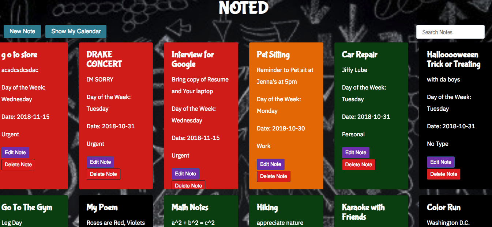
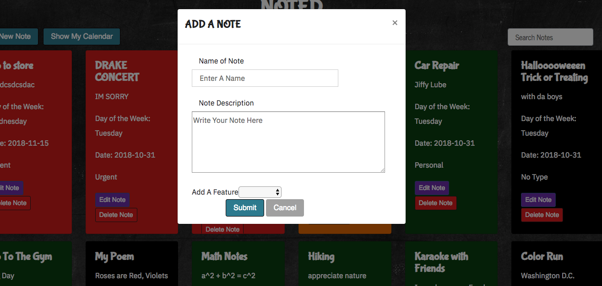
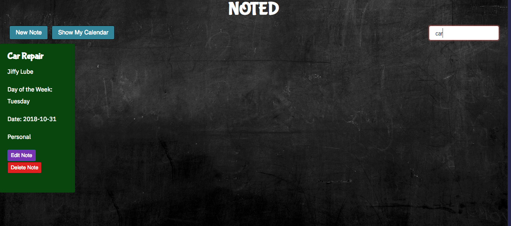
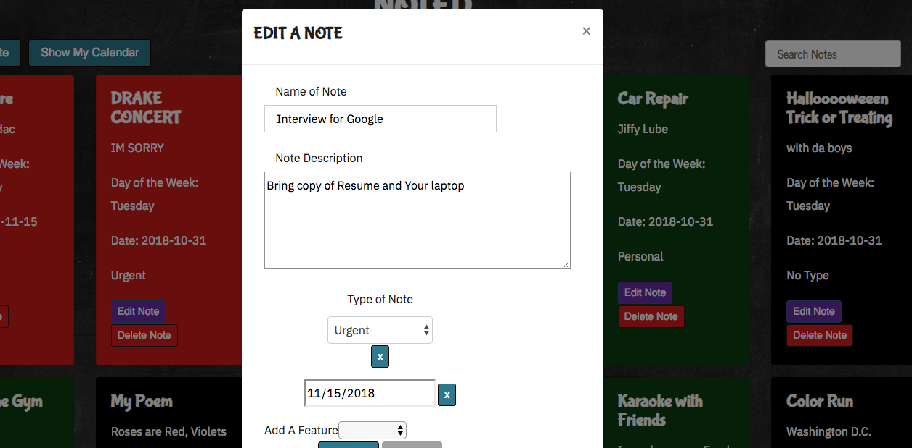

<h1 align="center">
  <br>
  
  <br>
NOTED  
<br>
</h1>

<h4 align="center">A single-page note-taking app with options to add types and deadlines that sync with a calendar. </h4>

<p align="center">
  <a href="#key-features">Key Features</a> •
  <a href="#how-to-use">How To Use</a> •
  <a href="#images">Images</a> •
</p>

## Key Features

- Notes - you can create edit, and delete a note.
  - The app uses modals to create these forms and the text area for the note is expandable.
- Assigning Options
  - You can assign a type to the particular note - urgent, personal, work, or not urgent. Each type is color-coded differently.
  - You can also assign a date to the note.
- Calendar
  - this app has a fully functional calendar, where you will see any notes that you have assigned dates to. You can choose to show your calendar by toggling the "show my calendar" button at the top left.

## How To Use

To clone and run this application, you'll need [Git](https://git-scm.com)

```bash
# Clone these two repositories
$ git clone https://github.com/samashtar/note-app-front-end/

## and clone this back-end
$ git clone
https://github.com/samashtar/noteapp

# Go into the back-end and set-up rails
$ cd noteapp

## migrate the database
$ rails db:migrate

##seed the database
$ rails db:seed

##run the server
$ rails s

#now cd into the front end and open index.html
$ cd note-app-front-end
#
$ open index.html
```

## Images

<h3 align="center">
Create A Note  <br>
  
  <br>
<br>
</h3>
<h3 align="center">

<h3 align="center">
Search Function 
  <br>
  
  <br>
<br>
</h3>

<h3 align="center">
Edit A Note  <br>
  
  <br>
<br>
</h3>
<h3 align="center">

---

> GitHub [@samashtar](https://github.com/samashtar/) &nbsp;&middot;&nbsp;
